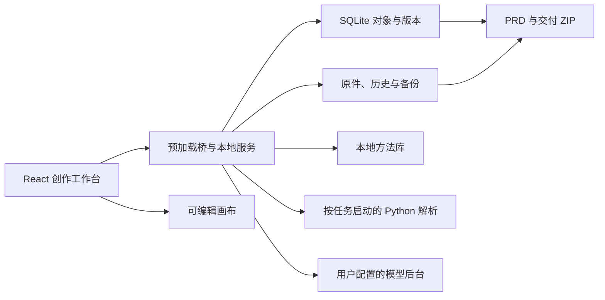

# 架构与数据流

原点由 Electron 桌面应用、React 创作界面、本地业务服务、文档解析进程与本地数据目录组成。模型后台作为独立进程运行。源码目录与用户数据分开。

## 模块职责

| 目录 | 职责 |
|---|---|
| `desktop/packages/desktop/src/renderer/pages/Studio/` | 首页、项目、四步创作流程、资料、方法、决定、画布与偏好 |
| `desktop/packages/desktop/src/common/studio/` | 蓝图规则、偏好选择、画布校验等共享业务逻辑 |
| `desktop/packages/desktop/src/common/types/studio.ts` | 对象、版本与交互契约 |
| `desktop/packages/desktop/src/process/services/studio/` | 保存、原件、方法、模型评审、项目包、备份与交付 |
| `desktop/packages/desktop/src/process/webserver/studio/` | 本地服务路由、认证与请求边界 |
| `workers/` | Python 文档适配器与解析测试 |
| `vendor/` | 固定版本的产品方法与画布组件 |
| `scripts/` | 安装、构建、正常与对抗测试 |

## 关键约束

界面通过有限接口读写业务对象，不直接操作数据库。更新进行版本检查，旧响应不能覆盖当前输入。正式决定使用独立确认路径；模型响应只能提供候选材料。

资料保留原件与 SHA-256，引用保存来源版本。文档生成和交付读取所采用的历史版本；来源变化标记依赖产物待复核。交付选择与完整项目恢复分别实现，避免为了交接一份 PRD 带出整个资料库。

解析工作进程限制文件格式、体积、页数及资源访问。PDF 使用轻量原生解析与本地 OCR，不在安装时下载大型语言模型。模型评审是独立的可选网络行为。

## 运行与分发

源码仓库不包含安装依赖、后端二进制、个人数据或构建输出。安装时读取固定依赖清单，后端下载使用 SHA-256 验证。桌面运行与设置仍包含必要的兼容协议标识；更换对外品牌不应破坏这些接口。

当前支持路径为 macOS Apple Silicon 源码运行。工程保留部分平台相关基础能力，但不据此承诺 Windows／Linux 安装可用。可分发安装包需要额外处理解析运行时、方法库、签名与公证，当前未发布安装包。
